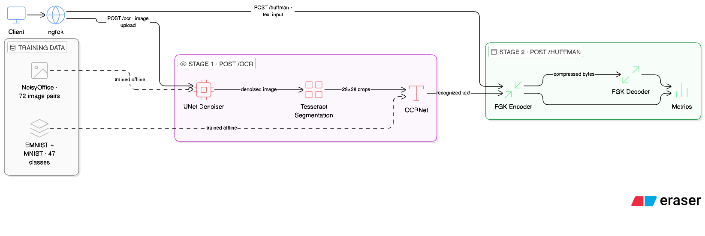

# OCR + Huffman Pipeline

Two-stage pipeline: extract text from noisy scanned document images, compress it with Adaptive Huffman Encoding. Stage 1 is a UNet denoiser + Tesseract segmentation + a CNN classifier trained on EMNIST. Stage 2 is a from-scratch FGK Adaptive Huffman implementation.

---

## Architecture



---

## Repository structure

```
ocr-huffman-pipeline/
├── api.py                        # Public API (/ocr + /huffman)
├── gradio_app.py                 # Gradio demo
├── benchmark.py                  # OCR accuracy, denoiser PSNR, latency
├── requirements.txt
│
├── stage1_ocr/
│   ├── ocr.py                    # OCRNet model, training, predict_batch
│   ├── denoiser.py               # UNet model, training, patch inference
│   ├── segmentation.py           # Tesseract character segmentation
│   ├── prepare_dataset.py        # Extract NoisyOffice crops for OCR training
│   └── weights/
│       ├── ocr.pth
│       ├── denoiser.pth
│       └── metrics.json
│
└── stage2_huffman/
    ├── huffman.py                # FGK Adaptive Huffman encode/decode
    ├── metrics.py                # compression_ratio, entropy, efficiency
    └── test_huffman.py           # 11 round-trip tests
```

---

## Dataset setup

### EMNIST
Downloaded automatically on first training run via `torchvision.datasets.EMNIST`.

### NoisyOffice
Place the dataset at the project root with the exact folder name:

```
ocr-huffman-pipeline/
└── Simulated Noisy Office/
    ├── simulated_noisy_images_grayscale/
    └── clean_images_grayscale/
```

72 images total. Filenames encode the split: `TR` = train, `VA` = val, `TE` = test.

---

## Setup

```bash
python -m venv .venv && source .venv/bin/activate
pip install -r requirements.txt

# macOS
brew install tesseract

# Ubuntu
sudo apt install tesseract-ocr
```

---

## Weights

Trained weights are included in the repo at `stage1_ocr/weights/` (`ocr.pth`, `denoiser.pth`).

---

## Training

**Step 1 — Prepare NoisyOffice character crops** (requires NoisyOffice dataset):

```bash
python stage1_ocr/prepare_dataset.py
```

Runs Tesseract on clean NoisyOffice images, extracts character bounding boxes, and saves clean + 4 noisy variants per character as 28×28 PNGs under `data/noisyoffice_crops/{train|val|test}/{label}/`.

**Step 2 — Train the denoiser**:

```bash
python stage1_ocr/denoiser.py
```

Saves `stage1_ocr/weights/denoiser.pth`.

**Step 3 — Train the OCR model**:

```bash
python stage1_ocr/ocr.py
```

Saves `stage1_ocr/weights/ocr.pth` and `metrics.json`.

---

## Running

### API (public)

**Base URL:** `https://liqueur-arrange-vagrantly.ngrok-free.dev`

**Interactive FastAPI docs:** `https://liqueur-arrange-vagrantly.ngrok-free.dev/docs`

To run locally:

```bash
uvicorn api:app --host 0.0.0.0 --port 8000 --reload
ngrok http 8000
```

### Gradio demo

```bash
python gradio_app.py
```

Upload a noisy document image, click **Run Pipeline**.

---

## API reference

### `POST /ocr`

```bash
curl -X POST https://liqueur-arrange-vagrantly.ngrok-free.dev/ocr \
  -F "image=@noisy_doc.png"
```

```json
{
  "text": "hello world",
  "char_count": 11,
  "latency_ms": 450.4,
  "emnist_digit_val_acc": 0.9697
}
```

### `POST /huffman`

```bash
curl -X POST https://liqueur-arrange-vagrantly.ngrok-free.dev/huffman \
  -H "Content-Type: application/json" \
  -d '{"text": "hello world"}'
```

```json
{
  "compressed_b64": "AAAAC...",
  "recovered_text": "hello world",
  "lossless": true,
  "original_bytes": 957,
  "compressed_bytes": 536,
  "compression_ratio": 1.7854,
  "entropy_bits_per_symbol": 4.098,
  "avg_code_length": 4.4441,
  "encoding_efficiency": 0.9221,
  "latency_ms": 140.05
}
```

### `GET /health`

```bash
curl https://liqueur-arrange-vagrantly.ngrok-free.dev/health
# {"status": "ok", "device": "mps"}
```

---

## Results

### OCR accuracy

| Validation set                          | Accuracy |
|-----------------------------------------|----------|
| EMNIST-MNIST, no noise                  | 96.97%   |
| EMNIST-MNIST, gaussian σ=0.15           | 96.92%   |
| EMNIST-MNIST, salt-pepper r=0.05        | 96.92%   |
| NoisyOffice crops (47-class)            | 88.34%   |

### Denoiser (NoisyOffice test split)

| Metric | Value    |
|--------|----------|
| MSE    | 0.000429 |
| PSNR   | 33.67 dB |

### Huffman compression

| Metric                  | Value |
|-------------------------|-------|
| Avg compression ratio   | 2.027 |
| Avg entropy (bits/sym)  | 2.692 |
| Avg encoding efficiency | 0.923 |

### End-to-end latency (Apple MPS)

| Stage              | Mean (ms) |
|--------------------|-----------|
| Denoiser           | 135.6     |
| Segmentation       | 262.5     |
| OCR (batch)        | 22.2      |
| Huffman encode     | 0.789     |
| Huffman decode     | 0.457     |
| **Total**          | 421.5     |

---

## Model details

### OCRNet

```
Input: 1 × 28 × 28 (grayscale, EMNIST-normalized)

Block 1: Conv2d(1→32, 3×3, pad=1) → BatchNorm2d → ReLU → MaxPool2d(2) → Dropout2d(0.25)
                                                                        → 32 × 14 × 14
Block 2: Conv2d(32→64, 3×3, pad=1) → BatchNorm2d → ReLU → MaxPool2d(2) → Dropout2d(0.25)
                                                                        → 64 × 7 × 7
Classifier: Flatten → Linear(3136→256) → ReLU → Dropout(0.5) → Linear(256→47)

Output: 47-class logits → argmax → lowercase character
```

**47 classes:** digits 0–9, uppercase A–Z, lowercase a b d e f g h n q r t — the 11 EMNIST Balanced classes distinct from their uppercase .

**Training:** EMNIST Balanced (112,800) + EMNIST MNIST (60,000) + NoisyOffice crops (clean + 4 noisy variants per character).

**Augmentation:** RandomAffine (±5°, ±10% translate), Gaussian noise (σ=0.15, p=0.4), salt-and-pepper (r=0.05, p=0.3).

**Optimizer:** Adam, lr=1e-3, weight_decay=1e-4, CosineAnnealingLR over 20 epochs.

**Design choices:**
- **3×3 kernels** — standard for 28×28 inputs; larger kernels would cover too much of the image at this resolution.
- **BatchNorm after every conv** — keeps training stable under noise augmentation.
- **Dropout2d(0.25)** — drops entire feature map channels; works better than pixel-level dropout for conv layers.
- **Dropout(0.5) before classifier** — heavier regularization at the 3136→256 bottleneck.

---

### UNet denoiser

```
Input: 1 × H × W (grayscale, padded to patch grid)

ConvBlock = Conv2d(3×3,pad=1) → BN → ReLU → Conv2d(3×3,pad=1) → BN → ReLU

Encoder (skip taken before MaxPool; pool feeds into the next block):
  e1 = ConvBlock(1→32)               →  32 × H    × W    [skip]
  e2 = ConvBlock(32→64,  pool(e1))   →  64 × H/2  × W/2  [skip]
  e3 = ConvBlock(64→128, pool(e2))   → 128 × H/4  × W/4  [skip]
  e4 = ConvBlock(128→256,pool(e3))   → 256 × H/8  × W/8  [skip]
  b  = ConvBlock(256→512,pool(e4))   → 512 × H/16 × W/16

Decoder (ConvTranspose2d(2×2, stride=2), cat skip, ConvBlock):
  up4(b)=256  cat e4=256  → ConvBlock(512→256) → 256 × H/8  × W/8
  up3=128     cat e3=128  → ConvBlock(256→128) → 128 × H/4  × W/4
  up2=64      cat e2=64   → ConvBlock(128→64)  →  64 × H/2  × W/2
  up1=32      cat e1=32   → ConvBlock(64→32)   →  32 × H    × W

Output: Conv2d(32→1, 1×1) → Sigmoid → 1 × H × W
```

Trained on 128×128 random patches from NoisyOffice paired (noisy, clean) scans. Inference runs on full-resolution images using overlapping 128×128 tiles (stride=96), averaged at overlaps.

**Design choices:**
- **Skip connections** — the encoder compresses spatial detail the decoder needs to reconstruct sharp character strokes. Without skips the output is too blurry for OCR.
- **base_ch=32** — NoisyOffice has 72 images; a bigger model overfits fast.
- **128×128 patches** — covers enough context for document noise; fits comfortably in memory during training.

---

## Huffman

Adaptive Huffman (FGK algorithm) implemented from scratch in `stage2_huffman/huffman.py`. No compression libraries used.

**How FGK works:** the tree satisfies the *sibling property* at all times — all nodes can be ordered by weight such that siblings are always adjacent. After each symbol is encoded, the tree is updated from the leaf upward, swapping nodes where needed to restore this property. The **NYT** (Not Yet Transmitted) node represents unseen symbols. When a new symbol arrives, its code is the NYT path + an 8-bit literal; after that it gets its own leaf with a proper codeword.

**Wire format:**
```
[4 bytes big-endian: byte count] [packed bitstream]
```
The byte count header lets the decoder stop exactly when it should, no EOF symbol needed.

**Tests:** 11 round-trip tests in `stage2_huffman/test_huffman.py` — empty string, single char, repeated chars, all 256 byte values, unicode, and random strings up to 2000 characters.

---

## Running tests

```bash
cd stage2_huffman && pytest test_huffman.py -v
```